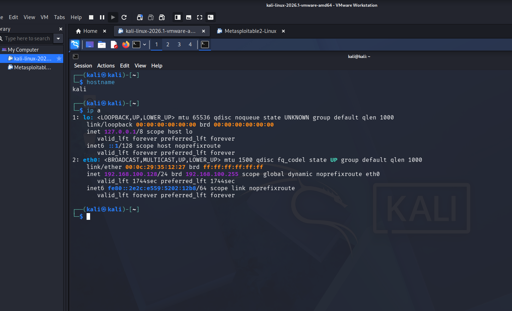
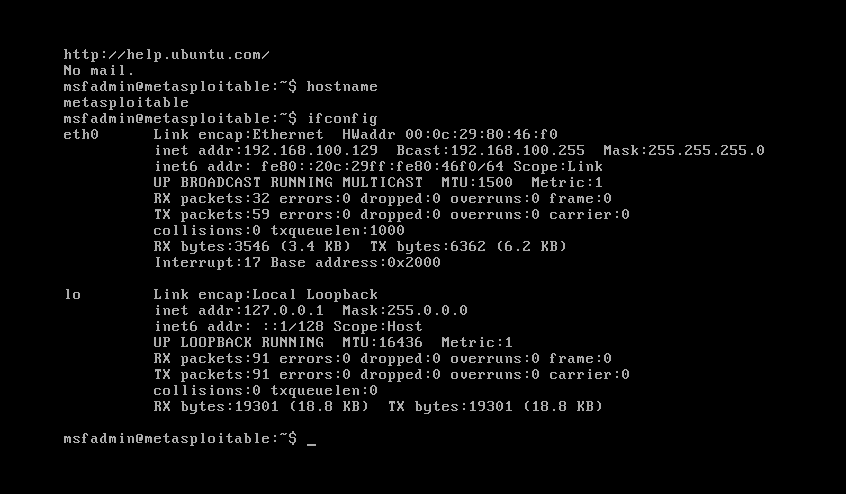
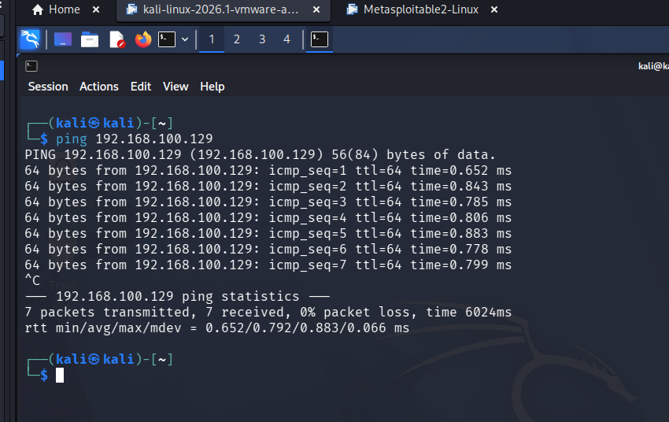
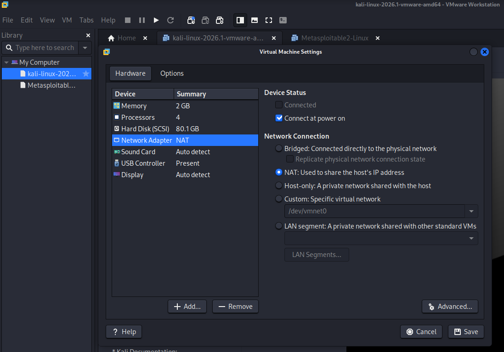

# Ethical Hacking Lab Setup and Verification

## Project Overview
This project demonstrates the setup and validation of an ethical hacking lab environment using Kali Linux and Metasploitable.

## Objectives
- Identify virtual machines and their IP addresses.
- Verify communication between attacker and target machines.
- Analyze VMware network adapter configurations.
- Ensure the lab environment is properly configured for security testing.

## Tools Used
- Kali Linux
- Metasploitable 2
- VMware Workstation

## Tasks Performed
- Machine Identification
- Connectivity Verification using Ping
- NAT and Host-Only Network Analysis
- Lab Validation

## Skills Gained
- Virtual Lab Setup
- Network Troubleshooting
- VMware Configuration
- Cybersecurity Environment Preparation

## Screenshots

### Kali Linux Identification

### Metasploitable Identification

### Connectivity Verification

### VMware Network Configuration

